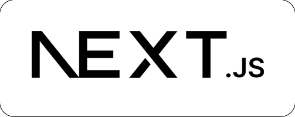
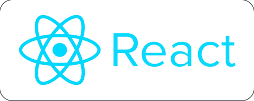
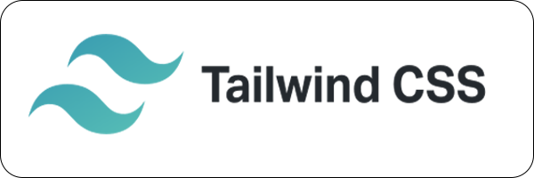
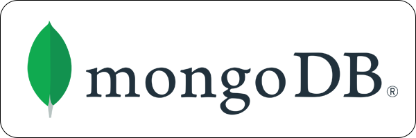
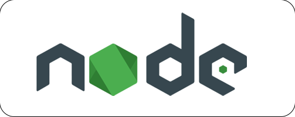
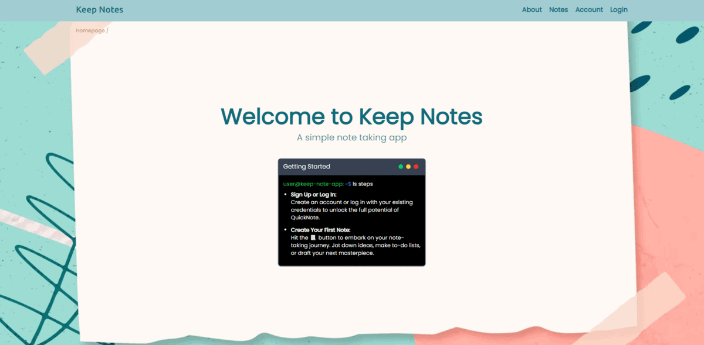

# Keep Notes App


### 👋 Hey there, <br/>
<p align="justify" >
 I'm Deva, and I'm super excited to introduce you to my very first app - the Keep Notes App! 🚀 As a fresh developer, I've poured my heart and soul into creating this app using some cool technologies like Next.js and MongoDB. You know how it is - we all have those lightbulb moments, brilliant ideas, and important to-do's that we just can't afford to forget. That's where Keep Notes App comes to the rescue. It's simple, it's easy, and it's here to make your life a bit more organized. </p>

### 📃 What's Inside:


- 📝 <b> Next.js Magic : </b> <p align="justify" > I've used Next.js to build the foundation of this app. It's like the secret sauce that makes everything smooth and snappy. So when you're jotting down your thoughts, you can expect a fast and seamless experience.

- 🗄️ <b>MongoDB Wizardry :</b> <p align="justify" > Ever heard of MongoDB? It's where all your notes hang out. This powerful technology ensures that your notes are safe and sound, just a click away whenever you need them.

- 🎨 <b>Looks Do Matter :</b> <p align="justify" > I believe in simplicity. That's why I've kept the design clean and easy on the eyes. No distractions, just you and your thoughts. And hey, you can even play around with different themes to make it your own!

- ☁️ <b>Cloudy with a Chance of Notes :</b> < align="justify" > Imagine this - your laptop suddenly decides to take a break, but no worries, your notes are safe in the cloud! With our cloud sync feature, your notes are like superheroes, ready to jump in and save the day.


<p align="justify" >
I'm still learning the ropes of this whole coding thing, but I'm super proud of what the Keep Notes App has become. It's not just an app; it's a little piece of my coding journey.
So, if you're a fellow developer exploring GitHub, feel free to check out the Keep Notes App. Clone it, fork it, break it (hopefully not too much), and let's learn and grow together!

Stay curious, <br/>
Deva


## Tech Stack

<div align="center" >
<br/>
 
&ensp;

&ensp;

&ensp;

&ensp;


</div>


## Table of Contents
- [Demo](#demo)
- [Getting started](#getting-started)
- [Project Requirements](#project-requirements)
- [Installation](#installation)
- [Contributing](#contributing)
- [License](#license)
- [Contact](#contact)

## Demo

<div align="center" >
&ensp;


</div>

#### Live Demo : [Keep Notes App](https://deva0813.github.io/keep_notes_nextjs/)

> [!NOTE]  
> The live demo is hosted on GitHub Pages and the data is stored in localStorage and sessionStorage. So, the data will be lost when the page is refreshed or when the browser is closed. To experience the full functionality of the app, please clone the repo and run it locally.

## Getting started
This project was bootstrapped with [Next.js](https://nextjs.org/).

### Project Requirements :
- [Node.js](https://nodejs.org/en/)
- [MongoDB](https://www.mongodb.com/)
- [Next.js](https://nextjs.org/)
- [React.js](https://reactjs.org/)
- [Tailwind CSS](https://tailwindcss.com/)

### Installation :
1. Clone the repo

   ```sh
   git clone https://github.com/Deva0813/keep_notes_nextjs.git
    ```
2. Install NPM packages

    ```sh
    # open the project folder
    cd keep_notes_nextjs

    # install dependencies
    npm install
    # or
    yarn install
    ```
3. Create a .env file in the root directory and add the following environment variables

    ```sh
    API_URL = <YOUR MONGODB DATA API>
    API_KEY= <YOUR API KEY>
    DATASOURCE= <YOUR CLUSTER>
    DATABASE= <YOUR DATABASE>
    ```
4. Run the development server

    ```sh
    npm run dev
    ```
5. Open [http://localhost:3000](http://localhost:3000) with your browser to see the result.

## Contributing
Pull requests are welcome. For major changes, please open an issue first to discuss what you would like to change.

## License

[MIT](https://choosealicense.com/licenses/mit/) © [Deva](https://github.com/Deva0813)  <br/>

## Contact
- [LinkedIn](https://www.linkedin.com/in/devanand-m-9a22351b3/)
- [Instagram](https://www.instagram.com/epic.dev/)
- [Email](mailto:devanand151101@gmail.com)
